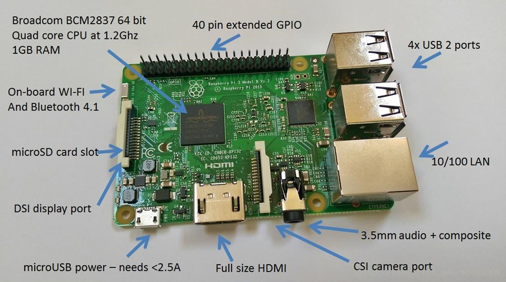

# 树莓派小车实验报告

# 1 小车构造及环境配置

## 1.1 硬件搭建

* 树莓派3B

* 两个PWM电机
* 两个红外传感器
* 一个超声波传感器
* 一个单目摄像头


## 1.2 系统烧录

1. 使用`树莓派镜像烧录器`


``下载直达        https://downloads.raspberrypi.org/imager/imager_latest.exe``


> ​	优点：
>
> 1. 可以直接在设置中配置网络环境
> 2. 可以选择多种操作系统

 	


* 操作步骤：

  

  * 下载镜像https://downloads.raspberrypi.org/raspios_arm64/images/raspios_arm64-2022-09-26/2022-09-22-raspios-bullseye-arm64.img.xz

  * 选择自定义镜像
  * 设置ssh和wifi

## 1.3 raspberry PI环境搭配

1.  首先对树莓派进行换源

   ```powershell
   * pi@raspberrypi:~ $ sudo nano /etc/apt/sources.list
   
     deb https://mirror.nju.edu.cn/debian/ bullseye main contrib non-free
     deb https://mirror.nju.edu.cn/debian-security/ bullseye-security main contrib non-free
     deb https://mirror.nju.edu.cn/debian bullseye-updates main contrib non-free
   
   * pi@raspberrypi:~ $ sudo nano /etc/apt/sources.list.d/raspi.list
   
     deb https://mirror.nju.edu.cn/raspberrypi/debian/ bullseye main
   ```

   

2. 更新

   ```powershell
   sudo apt-get update
   sudo apt-get upgrade
   ```

   

  

3. 安装OPENCV

   ```powershell
   sudo apt-get install python3-opencv
   ```

   

4. 配置摄像头选项

   ```powershell
   sudo raspi-config
   ```

   找到Interface Options --> Camera -->打开摄像头YES

   （可以在终端中查看device0是否存在）

## 1.4 PC端配置

1. VS code连接Raspberry Pi

​		配置SSH文件

```
#Read more about SSH config files: https://linux.die.net/man/5/ssh_config
Host copy								# PC名称，随便起
    HostName 192.168.43.162				# 树莓派地址，可以使用IP Scanner查看
    User pi								# 树莓派名称，在烧录SD卡的时候配置
    Port 22								# 默认22
```

*几点注意事项*:

> > HostName可以使用IP Scanner，如果是连接安卓手机可以通过手机热点直接查看，苹果手机不管是IP Scanner还是手机热点都看不了
>
> 
>
> > 改这个SSH会造成连不上GitHub的情况，如果想要重新连接GitHub，必须将上面注释，该车下面
> >
> > ``` 
> > Host github.com
> > Hostname ssh.github.com
> > Port 443
> > ```


2. 下载VNC Viewer

   

   连接方式也是通过SSH连接到小车地址

   

## 1.5 引脚分配


```python
# 设置gpio口为BOARD编号规范
gpio.setmode(gpio.BOARD)

# 定义引脚
#	电机
pin1 = 12  # 左正
pin2 = 16  # 左反
pin3 = 18  # 右正
pin4 = 22  # 右反
ENA = 38   # 左边电机使能
ENB = 40   # 右边电机使能
#	超声波
TRIG = 13  # send-pin
ECHO = 15  # receive-pin
#	红外线
GPIO_Infrared_left = 29		# 左边红外线
GPIO_Infrared_right = 31	# 右边红外线
```


# 2 八字循迹

## 1.1 电机控制

```python
def car_forward():  # 定义前进函数
    gpio.output(pin1, gpio.HIGH)  # 将pin1接口设置为高电压
    gpio.output(pin2, gpio.LOW)  # 将pin2接口设置为低电压
    gpio.output(pin3, gpio.HIGH)  # 将pin3接口设置为高电压
    gpio.output(pin4, gpio.LOW)  # 将pin4接口设置为低电压


def car_back():  # 定义后退函数
    gpio.output(pin1, gpio.LOW)
    gpio.output(pin2, gpio.HIGH)
    gpio.output(pin3, gpio.LOW)
    gpio.output(pin4, gpio.HIGH)


def car_left():  # 定义左转函数
    gpio.output(pin1, gpio.LOW)
    gpio.output(pin2, gpio.HIGH)
    gpio.output(pin3, gpio.HIGH)
    gpio.output(pin4, gpio.LOW)


def car_right():  # 定义右转函数
    gpio.output(pin1, gpio.HIGH)
    gpio.output(pin2, gpio.LOW)
    gpio.output(pin3, gpio.LOW)
    gpio.output(pin4, gpio.HIGH)


def car_stop():  # 定义停止函数
    gpio.output(pin1, gpio.LOW)
    gpio.output(pin2, gpio.LOW)
    gpio.output(pin3, gpio.LOW)
    gpio.output(pin4, gpio.LOW)
```

## 1.2 图像捕捉与处理

### 1.2.1 摄像头处理

```python
# 打开摄像头，图像尺寸640*480（长*高）
cap = cv2.VideoCapture(0)
# 设置捕捉到的图像为480*640
cap.set(3, 640)
cap.set(4, 480)
```

### 1.2.2 图像处理

```python
import time
import cv2
import numpy as np

cap = cv2.VideoCapture(0)
cap.set(3, 640)
cap.set(4, 480)
while (1):
    ret, frame = cap.read()
    cv2.imshow('frame', dst)  # 展示每一帧
    # 转化为灰度图
    gray = cv2.cvtColor(frame, cv2.COLOR_BGR2GRAY)
    cv2.imshow('gray', gray)  # 展示灰度图
    # 大津法二值化
    retval, dst = cv2.threshold(gray, 100, 255, cv2.THRESH_OTSU)
    # 膨胀，白区域变大
    dst = cv2.dilate(dst, None, iterations=2)
    cv2.imshow('dilate_frame', dst)  # 展示每一帧
    # 腐蚀，白区域变小
    dst = cv2.erode(dst, None, iterations=6)
    cv2.imshow('erode_frame', dst)  # 展示每一帧
    # 找到连续白色像素点最宽的那条
    if cv2.waitKey(1) & 0xFF == ord('q'):
        break

# 释放清理
cap.release()
cv2.destroyAllWindows()
```


**代码讲解**


> ```python
> ret, frame = cap.read()
> cv2.imshow('frame', dst)
> ```
>
> 


> ```python 
> gray = cv2.cvtColor(frame, cv2.COLOR_BGR2GRAY)
> cv2.imshow('gray', gray)  # 展示灰度图
> ```
>
> 
>
> 


> 这里我们先是将图像进行二值化
>
> `retval, dst = cv2.threshold(gray, 100, 255, cv2.THRESH_OTSU)`
>
> 这个阈值取决于环境


>
> ```python
> # 膨胀，白区域变大
> dst = cv2.dilate(dst, None, iterations=2)
> cv2.imshow('dilate_frame', dst)  # 展示每一帧
> ```
>
> 
>
> 如果只对图像进行膨胀则在边界处提取不够明显！！


> ```python
> # 腐蚀，白区域变小
> dst = cv2.erode(dst, None, iterations=6)
> cv2.imshow('erode_frame', dst)  # 展示每一帧
> ```
>
> 
>
> 如果只对图像进行腐蚀则图像特征不明显！！！


> ```python
> # 膨胀，白区域变大
> dst = cv2.dilate(dst, None, iterations=2)
> cv2.imshow('dilate_frame', dst)  # 展示每一帧
> # 腐蚀，白区域变小
> dst = cv2.erode(dst, None, iterations=6)
> cv2.imshow('erode_frame', dst)  # 展示每一帧
> ```
>
> 


### 1.2.3 结果展示

此处推荐先对图像进行高斯滤波


## 1.3 循迹策略

寻找第400行像素，找到最长的一段白色像素集合作为赛道，寻找赛道中点与320作为比较进行左右判断

```python
# 单看第400行的像素值
# print(dst.shape)
color = dst[400]
# 找到连续白色像素点最宽的那条
road_set = []
road_set_length = []
road = []
for i in range(len(color)):
    if (i == 639):
        road_set.append(road)
        road_set_length.append(len(road))
        break
    if color[i] == 255 and color[i + 1] == 255:
        road.append(i)
    elif (len(road) > 20 and color[i + 1] != 255):
        road_set.append(road)
        road_set_length.append(len(road))
        road = []
if (len(road_set_length) == 0):
    center = 320
elif (len(road) == 0):
    center = 320
else:
    index_ = road_set_length.index(max(road_set_length))
    road = road_set[index_]
    center = (min(road) + max(road)) / 2
# 计算出center与标准中心点的偏移量
# 如果为正，应该左转
direction = center - 320

print(direction)

threshold = 90                  #右转阈值
threshold_neg = -40      		#左转阈值
if abs(direction) >= threshold:
    # 右转
    if direction > threshold:
        car_forward()
        pwm1.ChangeDutyCycle(25 + direction / 18)
        pwm2.ChangeDutyCycle(0)
        if(direction>120 and direction <150):
            time.sleep(0.3)
        elif(direction >= 150):
            time.sleep(0.5)
                # 左转
    elif direction < threshold_neg:
        car_forward()
        pwm1.ChangeDutyCycle(0)
        pwm2.ChangeDutyCycle(25 + abs(direction) / 12)
        if(abs(direction)>120 and abs(direction)<150):
            time.sleep(0.3)
        elif(abs(direction)>=150):
            time.sleep(0.5)

else:
    car_forward()
    pwm1.ChangeDutyCycle(20)
    pwm2.ChangeDutyCycle(20)
```


## 1.4 结果展示

<video src="八字.mp4"></video>

# 3 乒乓球跟踪

## 1.1 图像处理

``` python
import cv2
import numpy as np
# https://www.cnblogs.com/bjxqmy/p/12333022.html
# https://blog.csdn.net/weixin_44237705/article/details/109021812
import RPi.GPIO as gpio
import time

# 定义引脚
pin1 = 12  # 左正
pin2 = 16  # 左反
pin3 = 18  # 右正
pin4 = 22  # 右反
ENA = 38
ENB = 40

# 设置gpio口为BOARD编号规范
gpio.setmode(gpio.BOARD)

# 设置gpio口为输出
gpio.setup(pin1, gpio.OUT)
gpio.setup(pin2, gpio.OUT)
gpio.setup(pin3, gpio.OUT)
gpio.setup(pin4, gpio.OUT)
gpio.setup(ENA, gpio.OUT)
gpio.setup(ENB, gpio.OUT)

# 设置PWM波,频率为500Hz
pwm1 = gpio.PWM(ENA, 50)
pwm2 = gpio.PWM(ENB, 50)

pwm1.start(0)
pwm2.start(0)


def car_forward():  # 定义前进函数
    gpio.output(pin1, gpio.HIGH)  # 将pin1接口设置为高电压
    gpio.output(pin2, gpio.LOW)  # 将pin2接口设置为低电压
    gpio.output(pin3, gpio.HIGH)  # 将pin3接口设置为高电压
    gpio.output(pin4, gpio.LOW)  # 将pin4接口设置为低电压


def car_back():  # 定义后退函数
    gpio.output(pin1, gpio.LOW)
    gpio.output(pin2, gpio.HIGH)
    gpio.output(pin3, gpio.LOW)
    gpio.output(pin4, gpio.HIGH)


def car_left():  # 定义左转函数
    gpio.output(pin1, gpio.LOW)
    gpio.output(pin2, gpio.HIGH)
    gpio.output(pin3, gpio.HIGH)
    gpio.output(pin4, gpio.LOW)


def car_right():  # 定义右转函数
    gpio.output(pin1, gpio.HIGH)
    gpio.output(pin2, gpio.LOW)
    gpio.output(pin3, gpio.LOW)
    gpio.output(pin4, gpio.HIGH)


def car_stop():  # 定义停止函数
    gpio.output(pin1, gpio.LOW)
    gpio.output(pin2, gpio.LOW)
    gpio.output(pin3, gpio.LOW)
    gpio.output(pin4, gpio.LOW)


def empty(a):
    pass


def draw_direction(img, lx, ly, nx, ny):
    dx = nx - lx
    dy = ny - ly
    if abs(dx) < 4 and abs(dy) < 4:
        dx = 0
        dy = 0
    else:
        r = (dx ** 2 + dy ** 2) ** 0.5
        dx = int(dx / r * 40)
        dy = int(dy / r * 40)
        # print(dx, dy)
    cv2.arrowedLine(img, (60, 100), (60 + dx, 100 + dy), (0, 255, 0), 2)
    # print(nx-lx, ny-ly)   # 噪声一般为+-1
    # cv2.arrowedLine(img, (150, 150), (150+(nx-lx), 150+(ny-ly)), (0, 0, 255), 2, 0, 0, 0.2)


def Hough_circle(imgGray, canvas):
    # 基于霍夫圆检测找圆，包含了必要的模糊步骤
    # 在imgGray中查找圆，在canvas中绘制结果
    # canvas必须是shape为[x, y, 3]的图片
    global Hough_x, Hough_y
    img = cv2.medianBlur(imgGray, 3)
    img = cv2.GaussianBlur(img, (17, 19), 0)
    # cv2.imshow("Blur", img)
    # cv2.waitKey(30)
    circles = cv2.HoughCircles(img, cv2.HOUGH_GRADIENT, 1, 200,
                               param1=20, param2=50, minRadius=30, maxRadius=70)
    try:
        # try语法保证在找到圆的前提下才进行绘制
        circles = np.uint16(np.around(circles))
        # print("circ:",circles)
        # 经测试，circles为：[[[c0_x, c0_y, c0_r], [c1_x, c1_y, c1_r], ...]]
        # 所以for i in circles[0, :]:中的i为每一个圆的xy坐标和半径
    except:
        pass
    else:
        for i in circles[0, :]:
            # draw the outer circle
            cv2.circle(canvas, (i[0], i[1]), i[2], (255, 100, 0), 2)
            # draw the center of the circle
            cv2.circle(canvas, (i[0], i[1]), 2, (0, 0, 255), 3)
            Hough_x = i[0]
            Hough_y = i[1]


frameWidth = 640
frameHeight = 480
cap = cv2.VideoCapture(0)  # 0对应笔记本自带摄像头
cap.set(3, frameWidth)  # set中，这里的3，下面的4和10是类似于功能号的东西，数字的值没有实际意义
cap.set(4, frameHeight)
cap.set(10, 80)  # 设置亮度
pulse_ms = 30
standard_area = 7000  # 设置乒乓球的标准大小，如果area大于这个值就要退后，如果小于这个值就前进
# 调试用代码，用来产生控制滑条
# cv2.namedWindow("HSV")
# cv2.resizeWindow("HSV", 640, 300)
# cv2.createTrackbar("HUE Min", "HSV", 4, 179, empty)
# cv2.createTrackbar("SAT Min", "HSV", 180, 255, empty)
# cv2.createTrackbar("VALUE Min", "HSV", 156, 255, empty)
# cv2.createTrackbar("HUE Max", "HSV", 32, 179, empty)
# cv2.createTrackbar("SAT Max", "HSV", 255, 255, empty)
# cv2.createTrackbar("VALUE Max", "HSV", 255, 255, empty)

lower = np.array([4, 180, 156])  # 适用于橙色乒乓球4<=h<=32
upper = np.array([32, 255, 255])

targetPos_x = 0  # 颜色检测得到的x坐标
targetPos_y = 0  # 颜色检测得到的y坐标
lastPos_x = 0  # 上一帧图像颜色检测得到的x坐标
lastPos_y = 0  # 上一帧图像颜色检测得到的y坐标
lastarea = 0
Hough_x = 0  # 霍夫圆检测得到的x坐标
Hough_y = 0  # 霍夫圆检测得到的y坐标
# ColorXs = []        # 这些是用来存储x，y坐标的列表，便于后期写入文件
# ColorYs = []
# HoughXs = []
# HoughYs = []

while True:
    _, img = cap.read()

    # 霍夫圆检测前的处理Start
    b, g, r = cv2.split(img)  # 分离三个颜色
    r = np.int16(r)  # 将红色与蓝色转换为int16，为了后期做差
    b = np.int16(b)
    r_minus_b = r - b  # 红色通道减去蓝色通道，得到r_minus_b
    r_minus_b = (r_minus_b + abs(r_minus_b)) / 2  # r_minus_b中小于0的全部转换为0
    r_minus_b = np.uint8(r_minus_b)  # 将数据类型转换回uint8
    # 霍夫圆检测前的处理End

    imgHough = img.copy()  # 用于绘制识别结果和输出

    imgHsv = cv2.cvtColor(img, cv2.COLOR_BGR2HSV)

    imgMask = cv2.inRange(imgHsv, lower, upper)  # 获取遮罩
    imgOutput = cv2.bitwise_and(img, img, mask=imgMask)
    contours, hierarchy = cv2.findContours(imgMask, cv2.RETR_EXTERNAL, cv2.CHAIN_APPROX_NONE)  # 查找轮廓
    # https://blog.csdn.net/laobai1015/article/details/76400725
    # CV_RETR_EXTERNAL 只检测最外围轮廓 RETE_FREE
    # CV_CHAIN_APPROX_NONE 保存物体边界上所有连续的轮廓点到contours向量内 CHAIN_APPROX_SIMPLE
    # print(np.array(contours).shape)     #查看提取的轮廓数量
    imgMask = cv2.cvtColor(imgMask, cv2.COLOR_GRAY2BGR)  # 转换后，后期才能够与原画面拼接，否则与原图维数不同

    # 下面的代码查找包围框，并绘制
    x, y, w, h = 0, 0, 0, 0
    for cnt in contours:
        area = cv2.contourArea(cnt)
        if area > 300:
            print("area", area)
            x, y, w, h = cv2.boundingRect(cnt)
            lastarea = area
            lastPos_x = targetPos_x
            lastPos_y = targetPos_y
            targetPos_x = int(x + w / 2)
            targetPos_y = int(y + h / 2)
            print("<targetPos_x,targetPos_y", targetPos_x, targetPos_y)
            cv2.rectangle(img, (x, y), (x + w, y + h), (0, 255, 0), 2)
            cv2.circle(img, (targetPos_x, targetPos_y), 2, (0, 255, 0), 4)

    # 坐标（图像内的）
    cv2.putText(img, "({:0<2d}, {:0<2d})".format(targetPos_x, targetPos_y), (20, 30),
                cv2.FONT_HERSHEY_PLAIN, 1, (0, 255, 0), 2)  # 文字
    draw_direction(img, lastPos_x, lastPos_y, targetPos_x, targetPos_y)

    # 霍夫圆检测Start
    Hough_circle(r_minus_b, imgHough)
    cv2.imshow("R_Minus_B", r_minus_b)
    cv2.putText(imgHough, "({:0<2d}, {:0<2d})".format(Hough_x, Hough_y), (20, 30),
                cv2.FONT_HERSHEY_PLAIN, 1, (255, 100, 0), 2)
    # 霍夫圆检测End

    imgStack = np.hstack([img, imgHough])
    # imgStack = np.hstack([img, imgMask])            # 拼接
    cv2.imshow('Horizontal Stacking', imgStack)  # 显示

    # ColorXs.append(targetPos_x)     # 坐标存入列表
    # ColorYs.append(targetPos_y)
    # HoughXs.append(Hough_x)
    # HoughYs.append(Hough_y)

    # 让小车跟踪乒乓球
    x_delta = targetPos_x - 320
    y_delta = targetPos_y - 240
    # 霍夫
    # x_delta = Hough_x - 320
    # y_delta = Hough_y - 240
    x_threshold = 40
    y_threshold = 30  # 阈值 可修改

    # 先调整左右方向,再前进后退
    if (abs(x_delta) <= x_threshold):
        # 球在中间
        if (abs(y_delta) <= y_threshold):
            # 正中间
            car_stop()
        elif (y_delta < y_threshold * -1):
            # 球在中上，前进
            car_forward()
            pwm1.ChangeDutyCycle(25)
            pwm2.ChangeDutyCycle(25)
        else:
            # 球在中下，后退
            car_back()
            pwm1.ChangeDutyCycle(25)
            pwm2.ChangeDutyCycle(25)

    elif (x_delta < x_threshold * -1):
        # 球在左边
        if (y_delta > y_threshold):
            # 球在左下，向右下方后退
            car_back()
            pwm1.ChangeDutyCycle(20 + abs(x_delta) / 20)
            pwm2.ChangeDutyCycle(0)
        else:
            # 球在左上、左中，向左上方前进
            car_forward()
            pwm1.ChangeDutyCycle(0)
            pwm2.ChangeDutyCycle(20 + abs(x_delta) / 20)
    else:
        # 球在右边
        if (y_delta > y_threshold):
            # 球在右下，向左下方后退
            car_back()
            pwm1.ChangeDutyCycle(0)
            pwm2.ChangeDutyCycle(20 + x_delta / 20)
        else:
            # 球在右上、右中，向右上方前进
            car_forward()
            pwm1.ChangeDutyCycle(20 + x_delta / 20)
            pwm2.ChangeDutyCycle(0)

    if cv2.waitKey(pulse_ms) & 0xFF == ord('q'):  # 按下“q”推出（英文输入法）
        print("Quit\n")
        break

cap.release()
cv2.destroyAllWindows()
```

> 将图像转换成HSV
>
> 
>
> 


## 1.2 图像结果


## 1.3 结果分析

我们最终没有选择使用霍夫检测，因为霍夫检测虽然在不太明亮的环境下检测效果好，但是当检测物体运动之后，检测效果很差，而只用色差的方法寻找边缘，能够很快的反应，它的缺点只有受光线影响，光照越强，检测效果越好。

# 4 红外避障

太简单了，就只放代码

```python
import RPi.GPIO as gpio
import time

# 定义引脚
pin1 = 12  # 左正
pin2 = 16  # 左反
pin3 = 18  # 右正
pin4 = 22  # 右反
ENA = 38
ENB = 40
GPIO_Infrared_left = 29
GPIO_Infrared_right = 31
gpio.setwarnings(False)
# 设置gpio口为BOARD编号规范
gpio.setmode(gpio.BOARD)


# 设置gpio口为输出
gpio.setup(pin1, gpio.OUT)
gpio.setup(pin2, gpio.OUT)
gpio.setup(pin3, gpio.OUT)
gpio.setup(pin4, gpio.OUT)
gpio.setup(ENA, gpio.OUT)
gpio.setup(ENB, gpio.OUT)
gpio.setup(GPIO_Infrared_left, gpio.IN)
gpio.setup(GPIO_Infrared_right, gpio.IN)
# 设置PWM波,频率为50Hz
pwm1 = gpio.PWM(ENA, 50)
pwm2 = gpio.PWM(ENB, 50)
pwm1.start(0)
pwm2.start(0)


def car_forward():  # 定义前进函数
    gpio.output(pin1, gpio.HIGH)  # 将pin1接口设置为高电压
    gpio.output(pin2, gpio.LOW)  # 将pin2接口设置为低电压
    gpio.output(pin3, gpio.HIGH)  # 将pin3接口设置为高电压
    gpio.output(pin4, gpio.LOW)  # 将pin4接口设置为低电压


def car_back():  # 定义后退函数
    gpio.output(pin1, gpio.LOW)
    gpio.output(pin2, gpio.HIGH)
    gpio.output(pin3, gpio.LOW)
    gpio.output(pin4, gpio.HIGH)


def car_left():  # 定义左转函数
    gpio.output(pin1, gpio.LOW)
    gpio.output(pin2, gpio.HIGH)
    gpio.output(pin3, gpio.HIGH)
    gpio.output(pin4, gpio.LOW)


def car_right():  # 定义右转函数
    gpio.output(pin1, gpio.HIGH)
    gpio.output(pin2, gpio.LOW)
    gpio.output(pin3, gpio.LOW)
    gpio.output(pin4, gpio.HIGH)


def car_stop():  # 定义停止函数
    gpio.output(pin1, gpio.LOW)
    gpio.output(pin2, gpio.LOW)
    gpio.output(pin3, gpio.LOW)
    gpio.output(pin4, gpio.LOW)


def InfraredMeasure():
    left_measure = gpio.input(GPIO_Infrared_left)  # if there is an obstacle, GPIO will become 0; else, GPIO_input = 1;
    right_measure = gpio.input(GPIO_Infrared_right)
    return [left_measure, right_measure]

def avoidance(left,right):
    if(left==0 and right !=0 ):
        car_back()
        pwm1.ChangeDutyCycle(25)
        pwm2.ChangeDutyCycle(25)
        time.sleep(1)
        car_right()
        pwm1.ChangeDutyCycle(40)
        pwm2.ChangeDutyCycle(40)
        print("detect obstacles in the left!")
        time.sleep(1)
    elif(left==0 and right ==0):
        car_back()
        pwm1.ChangeDutyCycle(40)
        pwm2.ChangeDutyCycle(40)
        print("detect obstacles in the left and right!")
        time.sleep(1)
    elif(left == 1 and right ==0):
        car_back()
        pwm1.ChangeDutyCycle(25)
        pwm2.ChangeDutyCycle(25)
        time.sleep(2)
        car_left()
        pwm1.ChangeDutyCycle(40)
        pwm2.ChangeDutyCycle(40)
        print("detect obstacles in the right!")
        time.sleep(1)
    else:
        car_forward()
        pwm1.ChangeDutyCycle(30)
        pwm2.ChangeDutyCycle(30)


def loop():
    while True:
        car_forward()
        pwm1.ChangeDutyCycle(30)
        pwm2.ChangeDutyCycle(30)
        [left, right] = InfraredMeasure()
        print(left,right)
        avoidance(left,right)
def destroy():
    gpio.cleanup()


try:
    loop()
except KeyboardInterrupt:
    destroy()
```

# 5 超声波避障

``` python
import RPi.GPIO as gpio
import time

# 定义引脚
pin1 = 12  # 左正
pin2 = 16  # 左反
pin3 = 18  # 右正
pin4 = 22  # 右反
ENA = 38
ENB = 40
TRIG = 13  # send-pin
ECHO = 15  # receive-pin

# 设置gpio口为BOARD编号规范
gpio.setmode(gpio.BOARD)

# 设置gpio口为输出
gpio.setup(pin1, gpio.OUT)
gpio.setup(pin2, gpio.OUT)
gpio.setup(pin3, gpio.OUT)
gpio.setup(pin4, gpio.OUT)
gpio.setup(ENA, gpio.OUT)
gpio.setup(ENB, gpio.OUT)

# 设置PWM波,频率为50Hz
pwm1 = gpio.PWM(ENA, 50)
pwm2 = gpio.PWM(ENB, 50)

pwm1.start(0)
pwm2.start(0)


def car_forward():  # 定义前进函数
    gpio.output(pin1, gpio.HIGH)  # 将pin1接口设置为高电压
    gpio.output(pin2, gpio.LOW)  # 将pin2接口设置为低电压
    gpio.output(pin3, gpio.HIGH)  # 将pin3接口设置为高电压
    gpio.output(pin4, gpio.LOW)  # 将pin4接口设置为低电压


def car_back():  # 定义后退函数
    gpio.output(pin1, gpio.LOW)
    gpio.output(pin2, gpio.HIGH)
    gpio.output(pin3, gpio.LOW)
    gpio.output(pin4, gpio.HIGH)


def car_left():  # 定义左转函数
    gpio.output(pin1, gpio.LOW)
    gpio.output(pin2, gpio.HIGH)
    gpio.output(pin3, gpio.HIGH)
    gpio.output(pin4, gpio.LOW)


def car_right():  # 定义右转函数
    gpio.output(pin1, gpio.HIGH)
    gpio.output(pin2, gpio.LOW)
    gpio.output(pin3, gpio.LOW)
    gpio.output(pin4, gpio.HIGH)


def car_stop():  # 定义停止函数
    gpio.output(pin1, gpio.LOW)
    gpio.output(pin2, gpio.LOW)
    gpio.output(pin3, gpio.LOW)
    gpio.output(pin4, gpio.LOW)


def setup():
    gpio.setup(TRIG, gpio.OUT, initial=gpio.LOW)
    gpio.setup(ECHO, gpio.IN)
    gpio.setwarnings(False)  # 关闭警告


def distance():
    gpio.output(TRIG, 1)  # 给Trig一个10US以上的高电平
    time.sleep(0.00001)
    gpio.output(TRIG, 0)

    # 等待低电平结束，然后记录时间
    while gpio.input(ECHO) == 0:  # 捕捉 echo 端输出上升沿
        pass
    time1 = time.time()

    # 等待高电平结束，然后记录时间
    while gpio.input(ECHO) == 1:  # 捕捉 echo 端输出下降沿
        pass
    time2 = time.time()

    during = time2 - time1
    # ECHO高电平时刻时间减去低电平时刻时间，所得时间为超声波传播时间
    return during * 340 / 2 * 100


# 超声波传播速度为340m/s,最后单位米换算为厘米，所以乘以100
def loop():
    while True:
        dis = distance()
        print(dis, "cm\n")
        # print dis, 'cm'
        # print ''
        time.sleep(0.3)
        car_forward()
        pwm1.ChangeDutyCycle(30)
        pwm2.ChangeDutyCycle(30)
        if (dis < 30):
            car_back()
            pwm1.ChangeDutyCycle(40)
            pwm2.ChangeDutyCycle(40)
            time.sleep(1)
            car_forward()
            pwm1.ChangeDutyCycle(40)
            pwm2.ChangeDutyCycle(0)
            time.sleep(1)


def destroy():
    gpio.cleanup()


if __name__ == "__main__":
    setup()
    try:
        loop()
    except KeyboardInterrupt:
        destroy()
```


